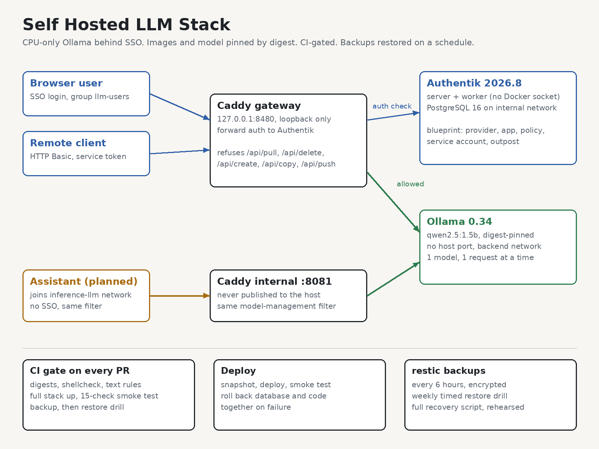

# Self Hosted LLM Stack

[](https://github.com/AhmedSarfrazKhan/SelfHostedLLMStack/actions/workflows/ci.yml)

A self-hosted AI inference stack that can be changed safely. A language model served by
Ollama on a CPU, behind single sign-on, with every image and the model itself pinned
by digest, a CI gate that brings the whole stack up on every pull request, and backups
that get restored on a schedule rather than assumed.

The sibling of [odoo-reference-stack](https://github.com/Onpoint-XS/odoo-reference-stack),
built on the same principles for a different workload.

Getting a model to answer on your own hardware is an afternoon's work. Keeping it
changeable, reachable only by the right people, and recoverable is the part this
repository is about. Everything here exists because of something that goes wrong:

- A model tag is re-published upstream, and a rebuilt host serves weights nobody tested.
- Ollama's API has no authentication, and pull, create and delete are on the same port
  as chat. Anyone who can reach it can replace the model or fill the disk.
- An SSO change is "just config", merges untested, and either locks everyone out or lets
  everyone in.
- An Authentik upgrade migrates the database, the new version fails, and the old version
  cannot run against the migrated schema.
- Somebody has backups. Nobody has ever restored one, or timed it.

## What is in here

| Piece | File | What it is for |
|---|---|---|
| Compose stack | `compose.yaml` | Ollama, Authentik, PostgreSQL, Caddy. Every image pinned by digest |
| Model pin | `config/models.lock` | The model, pinned by manifest digest like an image |
| Gateway | `config/caddy/Caddyfile` | Forward auth in front of the model; model management refused |
| SSO as code | `config/authentik/blueprints/` | Provider, application, access policy, service account |
| CI | `.github/workflows/ci.yml` | Static checks, then the full stack up, smoke test, backup, drill |
| Deploy | `.github/workflows/deploy.yml` | Snapshot, deploy, smoke test, roll back on failure |
| Smoke test | `scripts/smoke_test.sh` | 15 checks, from outside, the way clients use the stack |
| Model guard | `scripts/pull_model.sh` | Refuses to pull if the registry digest moved |
| Drift repair | `scripts/apply_blueprint.sh` | Re-applies the SSO blueprint on every deploy |
| Rollback | `scripts/rollback.sh` | Restores the database **and** the code together |
| Backup | `scripts/backup.sh` | restic, every six hours, from a pinned container |
| Restore drill | `scripts/restore_drill.sh` | Restores into a throwaway database, checks it, times it |
| Recovery | `scripts/recover.sh` | Rebuilds the stack from a snapshot on a clean host |
| Runbook | `docs/runbook.md` | Symptoms, fixes, and how to make routine changes |
| DR plan | `docs/disaster-recovery.md` | RPO, RTO, and what has actually been rehearsed |
| GPU path | `docs/gpu.md` | **Untested.** How the same stack would use an NVIDIA GPU |
| Assistant design | `docs/openclaw-integration.md` | The contract for an assistant built on top |

## How requests flow



```
                          127.0.0.1:8480
 browser / remote client ───────────────► Caddy ──forward auth──► Authentik (server, worker, PostgreSQL)
                                            │
                                            │  /api/pull, /api/delete, ... ──► 403
                                            ▼
                                          Ollama  (no host port, backend network only)
                                            ▲
 assistant on this host ──► gateway:8081 ───┘   (inference-llm network, no SSO, same filter)
```

People in a browser log in through Authentik and must be in the `llm-users` group.
Remote programs send HTTP Basic with a service account's app password. Services on this
host join the `inference-llm` Docker network and use an internal listener that is never
published. All three paths go through the same filter, so none of them can pull,
replace or delete the model.

## The model is pinned like an image

`config/models.lock` holds the model's manifest digest. `scripts/pull_model.sh` asks the
registry for the digest **before** pulling and refuses if it has moved, because
`ollama pull` overwrites the local copy and checking afterwards only tells you the tested
weights are gone. `scripts/assert_model.sh` checks what is actually loaded, and the smoke
test runs it after every deploy.

## Proving it works, not that it is running

Every container can be healthy while the thing people use is broken. So the smoke test
drives the stack from outside:

```
$ scripts/smoke_test.sh
==> smoke test against http://llm.localhost:8480 (model qwen2.5:1.5b)
  ok    ollama publishes no host port
  ok    model digest matches models.lock
  ok    unauthenticated request redirected to Authentik
  ok    wrong service token refused (302)
  ok    service token accepted
  ok    chat completion through SSO in 623 ms: "Ready"
  ok    management /api/pull refused with valid credentials
  ...
  ok    browser login as a member of llm-users reaches the model
  ok    browser login outside llm-users is refused (302)
==> smoke test PASSED
```

The last two log in through Authentik's real login flow as throwaway users, one in the
group and one not, and delete them afterwards. An access rule that is not tested is a
rule that stops working the first time somebody refactors the Caddyfile.

A test that never fails proves nothing, so the smoke test was checked by breaking the
stack on purpose. Removing the management filter from the internal listener failed it
(`/api/pull` answered 400 instead of 403). Deleting the access policy failed it (a user
outside `llm-users` reached the model). The second break also found a real gap:
restarting Authentik does not re-apply its blueprint, so the deleted policy stayed
deleted. `scripts/apply_blueprint.sh` now runs on every deploy and recovery, so drift is
corrected rather than just detected.

CI runs this against the full stack on every pull request, then takes a backup and runs
the restore drill against it. The deploy workflow runs it after every deploy and rolls
back when it fails.

## Backups you have actually restored

`scripts/backup.sh` dumps the Authentik database, archives its data volume, and stores
both with restic, along with `.env` and a manifest of the commit, image digests and
model pins the data belongs to. Every artifact is validated before restic sees it.

`scripts/restore_drill.sh` restores the latest snapshot into a throwaway PostgreSQL with
no network, running the exact image production pins, checks that the SSO configuration
is in it, and fails if it took longer than the RTO allows:

```
$ scripts/restore_drill.sh
==> restoring snapshot 6d5e17a3
==> starting a throwaway PostgreSQL (no network)
==> restoring the Authentik database
    users                                      1
    LLM gateway application                    1
    llm-users group bindings                   1
    service account app passwords              1
    applied blueprints                         1
==> checking archives
    authentik-data.tgz                         2 entries
==> restore completed in 0m10s (limit 15m00s)
==> drill PASSED, throwaway database removed
```

And `scripts/recover.sh` does the whole thing for real: stack gone, volumes gone, images
gone, `.env` gone, rebuilt from the snapshot. The measured time is in
[the DR plan](docs/disaster-recovery.md).

## Measured on the development host

An Intel i5-8500 (6 cores, AVX2), 12 GB of RAM shared with other services, no GPU.
Ollama limited to 4 cores.

| | |
|---|---|
| Generation | about 11 tokens/s |
| Prompt processing | about 140 tokens/s |
| Model resident memory (`qwen2.5:1.5b`, 8k context) | 1.3 GiB |
| Whole stack resident memory | about 2.3 GiB |
| Cold start to healthy | about 2.5 min |
| Backup | 4 s |
| Restore drill (data) | 10 s |
| Full recovery, clean host to serving | 11 min 9 s (7 min 51 s of it image downloads) |

These numbers are why the model is small. A 1.5B model proves the stack and handles
simple tasks; it is not a substitute for a large one. See `docs/gpu.md` for what changes
with a GPU, which I have not tested.

## Running it

```bash
scripts/init_env.sh              # .env with random secrets, and a restic password file
docker compose up -d --wait
scripts/apply_blueprint.sh
scripts/pull_model.sh
scripts/smoke_test.sh
scripts/restic.sh init && scripts/backup.sh && scripts/restore_drill.sh
```

The gateway is on `127.0.0.1:8480`. Authentik is at `http://auth.localhost:8480`
(user `akadmin`, password from `AUTHENTIK_BOOTSTRAP_PASSWORD` in `.env`); the model is
at `http://llm.localhost:8480`. `*.localhost` resolves to loopback without DNS setup.

Nothing binds to ports 80 or 443, and every name, network and volume is prefixed, so it
can share a host with other services. Check what is already running first.

## What this is not

Not a model-serving platform for many users, not a Kubernetes reference, and not fast.
It is a single-host inference service done carefully: small enough to run on hardware
most people already have, strict enough to change without fear.

## Licence

MIT. Take any of it.
